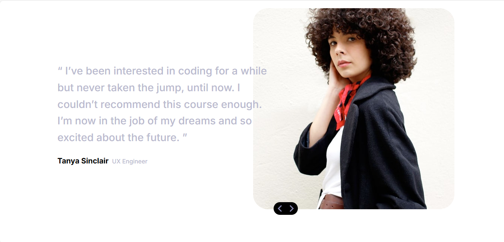

# Frontend Mentor - Coding bootcamp testimonials slider

This is a solution to the [Coding bootcamp testimonials slider](https://www.frontendmentor.io/challenges/coding-bootcamp-testimonials-slider-4FNyLA8JL). Frontend Mentor challenges help you improve your coding skills by building realistic projects.

## Table of contents

- [Overview](#overview)
  - [The challenge](#the-challenge)
  - [Screenshot](#screenshot)
  - [Links](#links)
  - [Installation](#Installation)
- [My process](#my-process)
  - [Features](#Features)
  - [What I learned](#what-i-learned)
  - [Continued development](#continued-development)
- [Author](#author)
- [Acknowledgments](#Acknowledgments)

## Overview

### The challenge

This challenge will be a nice test if you're new to JavaScript. It's also a great opportunity to play around with content animations and transitions.

Your users should be able to:

- Navigate the slider using either their mouse/trackpad or keyboard
- View the optimal layout for the interface depending on their device's screen size
- See hover and focus states for all interactive elements on the page

### Screenshot



### Links

- Solution URL: [here](https://github.com/olahasan/HTML_CSS_JAND_J.S_Frontend-Mentor_JUNIOR-Coding-Bootcamp-Testimonials-Slider)

- Live Site URL: [here](https://olahasan.github.io/HTML_CSS_JAND_J.S_Frontend-Mentor_JUNIOR-Coding-Bootcamp-Testimonials-Slider/)

## Installation

To get a local copy up and running, follow these simple steps:

1. **Clone the repository**:

   ```sh
   git clone https://github.com/your-username/your-repo-name.git
   ```

2. **Navigate to the project directory**:

   ```sh
   cd your-repo-name
   ```

3. **Open the project in your preferred code editor**.

## My process

## Features

- Responsive design
- Smooth transitions between testimonials
- Lazy loading for images
- Accessible navigation

### What I Learned

Through this project, I learned how to:

- Implement a responsive design using CSS Flexbox and media queries.
- Use JavaScript to dynamically update content and handle user interactions.
- Optimize images with lazy loading for better performance.
- Enhance accessibility by using appropriate HTML attributes and ARIA roles.

### Continued Development

For future development, I plan to:

- Add more testimonials to the slider.
- Implement additional animations for smoother transitions.
- Improve accessibility features based on user feedback.
- Explore using a JavaScript framework like React for better state management.

### Author

Frontend Mentor - @olahasan<br>
GitHub - @olahasan

### Acknowledgments

I would like to thank the **Frontend Mentor** for providing this challenge and to the community for their support and feedback
